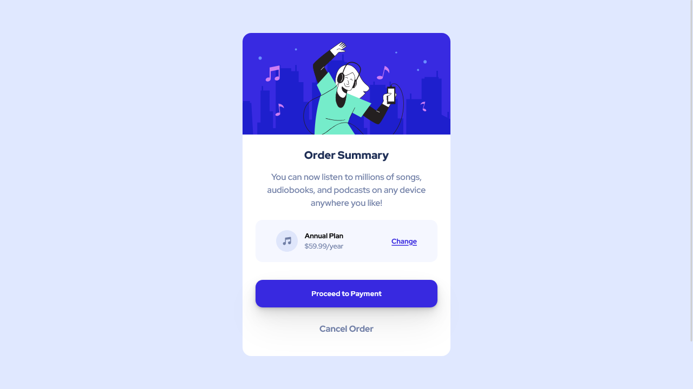

# Frontend Mentor - Order summary card solution

This is a solution to the [Order summary card challenge on Frontend Mentor](https://www.frontendmentor.io/challenges/order-summary-component-QlPmajDUj). Frontend Mentor challenges help you improve your coding skills by building realistic projects.

## Table of contents

- [Overview](#overview)
  - [The challenge](#the-challenge)
  - [Screenshot](#screenshot)
  - [Links](#links)
- [My process](#my-process)
  - [Built with](#built-with)
  - [What I learned](#what-i-learned)
  - [Useful resources](#useful-resources)
- [Author](#author)

## Overview

### The challenge

Users should be able to:

- See hover states for interactive elements

### Screenshot



### Links

- Solution URL: [@GitHub](https://github.com/xdelmo/order-summary-component)
- Live Site URL: [@GitHub](https://htmlpreview.github.io/?https://github.com/xdelmo/order-summary-component/blob/master/index.html)

## My process

### Built with

- Semantic HTML5 markup
- CSS custom properties
- Flexbox

- Mobile-first workflow

### What I learned

To hide hero image's top corners I use this CSS style but I don't think it's the best method

```css
.card__imgHero {
  border-top-left-radius: 1em;
  border-top-right-radius: 1em;
}
```

### Useful resources

- [How do I prevent an image from overflowing a rounded corner box?](https://stackoverflow.com/questions/587814/how-do-i-prevent-an-image-from-overflowing-a-rounded-corner-box) - This helped me to hidden hero image's top corners

## Author

- Website - [Emanuele Del Monte](https://www.emanueledelmonte.it)
- Frontend Mentor - [@xdelmo](https://www.frontendmentor.io/profile/xdelmo)
